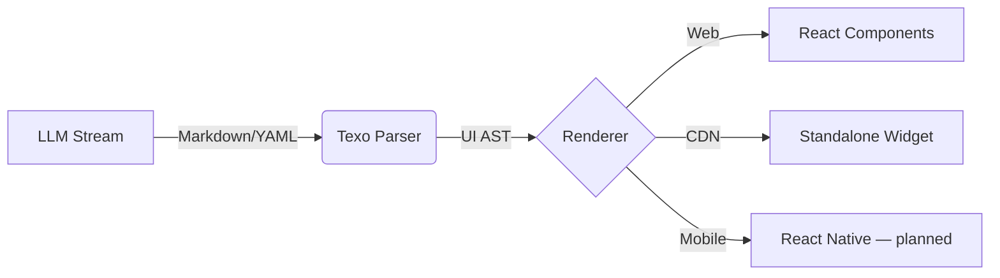

# Youngjune Kwon

**Full-cycle product engineer** · Seoul, Korea (KST, UTC+9) · 20+ years in software

**2 apps on the App Store · 19 packages on npm · 1 on PyPI · 3 images on Docker Hub**

I ship end to end on my own: product design → implementation → infrastructure → billing →
App Store review → operations.

> Descriptions below are quoted from each project's own README, package manifest, or store listing.

---

## 1. Shipped products

### iOS apps

<table>
<tr>
<td width="110" align="center">
<a href="https://apps.apple.com/kr/app/valetfs/id6804526734">
 
<b>ValetFS</b></a>
</td>
<td>

**[ValetFS](https://apps.apple.com/kr/app/valetfs/id6804526734)** · v1.1.2 · released 2026-08-31 · Developer Tools · 7 languages

> "Keep API keys on your phone and lend them to an AI agent's machine — in memory only, never on
> disk, and only while you allow it."
>
> "ValetFS is a Zero-Backend, P2P, in-memory virtual file system that exposes short-lived tokens
> and keys to AI agents only while a paired mobile app allows it."

`Go` `FUSE` `WebDAV` `WebRTC (pion)` `Cloudflare Worker` `React Native` · `iOS` `macOS` `Linux`
Daemon and CLI open source → [winm2m/valet-fs](https://github.com/winm2m/valet-fs)

</td>
</tr>
</table>

 

<table>
<tr>
<td width="110" align="center">
<a href="https://apps.apple.com/kr/app/id6806914044">
 
<b>Sidera</b></a>
</td>
<td>

**[Sidera — 사주와 별자리](https://apps.apple.com/kr/app/id6806914044)** · v1.4.0 · released 2026-09-03 · Lifestyle
**Contract development** — built end to end for a client and published under their App Store account.

> "출생 차트를 결정론적으로 계산하고, 그 결과를 근거로 LLM이 해석해 주는 점성술 앱."
> *(An astrology app that computes the natal chart deterministically and has an LLM interpret the
> computed result.)*

`Python` `FastAPI` `SQLAlchemy` `TypeScript` `Expo SDK 54` · `iOS`
Source is the client's and stays private. The astronomy engine is dependency-free pure Python —
an LLM cannot compute celestial positions and will hallucinate them, so the backend owns the
calculation and the model only interprets its output.

</td>
</tr>
</table>

### Web product

**[Proveri](https://proveri.ai)** — survey and statistics SaaS

> "Surveys with publication-ready statistics, in your browser."
>
> "Build a survey, collect verified responses, and run publication-ready statistics — chi-square,
> t-tests, ANOVA, Cronbach's alpha and more — without leaving your browser."

`Python` `FastAPI` `PostgreSQL` `React` `TanStack` `Paddle` `Apple IAP` `GCP Cloud Run` `Cloudflare`
Source private.

---

### npm — 19 packages across 5 scopes

**Statistics in the browser** — the computation layer behind Proveri

> "A headless JavaScript SDK for advanced statistical analysis in the browser using WebAssembly
> (Pyodide). Performs SPSS-level inferential statistics entirely client-side with no backend
> required."

**Texo — generatable UI for LLM streams**

> "Weave Text into UI. A stream-oriented Generatable UI framework for the LLM era."
>
> "Unlike Vercel's `v0` or standard generative UI tools that rely on brittle JSON or raw HTML
> generation, Texo uses a robust, human-readable syntax (Markdown Directives + YAML) to 'weave' UI
> components in real-time."

**Flux-Mask — client-side request encryption**

> "Client-side libraries for Flux-Mask encryption." — core cryptography utilities, an Axios
> interceptor, and a Fetch wrapper. The server half ships as the `winm2m/fluxmask-nginx` image
> below.

**Everything else**

| Package | Version | Published | Description |
|---|---|---|---|
| [@winm2m/shadow-translate-bridge](https://www.npmjs.com/package/@winm2m/shadow-translate-bridge) | 1.5.0 | 2026-03 | "A bridge to sync Shadow DOM content with browser translation engines via Mirroring API" |
| [leanprompt-client](https://www.npmjs.com/package/leanprompt-client) | 0.1.1 | 2026-02 | "React client for LeanPrompt WebSocket communication" |
| [@proveri/survey-core](https://www.npmjs.com/package/@proveri/survey-core) | 0.0.2 | 2026-06 | Survey runtime functionality |
| [@winm2m/pretty-textarea](https://www.npmjs.com/package/@winm2m/pretty-textarea) | 1.0.5 | 2025-06 | "A WebComponent textarea implementation with custom properties and styles" |
| [@winm2m/web](https://www.npmjs.com/package/@winm2m/web) | 1.2.4 | 2024-09 | "A package for developing webbased user service" |
| [@winm2m/cfworker-base](https://www.npmjs.com/package/@winm2m/cfworker-base) | 1.1.0 | 2023-01 | "A library for creating basic CRUD endpoints for Cloudflare Workers" |
| [@winm2m/argos-api](https://www.npmjs.com/package/@winm2m/argos-api) | 0.3.1 | 2023-01 | "API for the Argos IoT Mobile Web/APP" |
| [cf-worker-mqtt-relay](https://www.npmjs.com/package/cf-worker-mqtt-relay) | 1.0.0 | 2022-12 | "A relay server for simple communication with external MQTT servers in Cloudflare Worker" |

### PyPI

> "A lightweight, engineering-first LLM framework for FastAPI featuring session-based context
> caching and reliable output validation."

13 releases, 0.1.0 → 0.4.4 · MIT

### Docker Hub

| Image | Description |
|---|---|
| `winm2m/fluxmask-nginx` | "This Docker image provides Nginx with the Flux-Mask Lua plugin pre-installed and configured." |
| `winm2m/opencode` | "A ready-to-use Docker image for running OpenCode with all necessary models and dependencies pre-downloaded." |
| `winm2m/email-forward` | "A Docker image that forwards emails received to the specified host to another address." |

---

## 2. Public repositories — timeline

Reverse chronological. Forks of third-party projects are omitted.

### 2026

 · `Go` `FUSE` `WebDAV` · `macOS` `Linux`
> "ValetFS is a Zero-Backend, P2P, in-memory virtual file system that exposes short-lived tokens
> and keys to AI agents only while a paired mobile app allows it. … No root, drivers, or FUSE are
> required — if FUSE is unavailable the daemon serves files over a loopback WebDAV endpoint and
> the local CLI instead."

 · `TypeScript` `React` · `Web`
> See Texo above.

 · `Rust` `Tauri` · `Windows` `macOS`
> "A desktop timer that treats your first keyboard/mouse input of the day as the start of work,
> then shows the time remaining until the agreed workday is over and alerts you when it ends."

 · `Python` · `Linux`
> "Hear what Claude Code just did, and answer it out loud — without opening the laptop. Every time
> a Claude Code turn ends, its response is summarized into a few sentences written for the ear and
> pushed to Telegram. Reply there by voice and the session picks up where it left off."

 · `Python` `Node.js` `Vite` · `Linux`
> "Python + Node.js based monorepo for automated trading operations with a broker-agnostic
> architecture. … Start with Korea Investment & Securities (KIS) Open API, but keep broker
> integrations pluggable. Provide safety-first controls such as forced stop-loss sell and
> emergency stop."

 · `Docker` · `Linux`
> "A ready-to-use Docker image for running OpenCode with all necessary models and dependencies
> pre-downloaded. … Automatically built and pushed to Docker Hub on every Dockerfile update."

 · `Python` — **most-starred repository**
A maintained fork of [semopy](https://bitbucket.org/herrberg/semopy):
> "semopy is an umbrella Python package that includes numerous Structural Equation Modelling (SEM)
> techniques."

 · `Python` `FastAPI`
 · `TypeScript` `React`
> "A lightweight, engineering-first LLM framework for FastAPI featuring session-based context
> caching and reliable output validation." / "A React client library for LeanPrompt, providing
> seamless WebSocket synchronization and streaming hooks for AI-driven applications."

 · `TypeScript` · `Web`
> "A lightweight bridge to sync Shadow DOM content with browser translation engines (like Google
> Translate)."

 · `JavaScript` · `Chrome`
> "A Chrome extension that replaces parts of HTTP request strings with desired strings before
> sending the request. … Regex pattern matching and group references. … Provides Requestly-style
> replace functionality for free. … UI language automatically adapts to your Chrome browser
> language (English, French, Spanish, Arabic, Chinese, Russian, Korean)."

### 2025

**[flux-mask-clients](https://github.com/YoungjuneKwon/flux-mask-clients)** · 2025-12 · `TypeScript` · `Web` — see Flux-Mask above

**[froala-under-closed-shadowroot](https://github.com/YoungjuneKwon/froala-under-closed-shadowroot)** · 2025-11 · `JavaScript` · `Web`
> "Sample code for using Froala WYSIWYG editor under a closed shadow root."

**[signal-factory](https://github.com/YoungjuneKwon/signal-factory)** · 2025-11
> "Signal Factory - 상세 기획 문서."

**[product-2025-report-email-consultation](https://github.com/YoungjuneKwon/product-2025-report-email-consultation)** · 2025-10 · `Python`
> "Gmail 상담 메일을 수집하고 Excel 보고서를 생성하는 Python 프로젝트."

**[tailwind-shadcn-webcomponent](https://github.com/YoungjuneKwon/tailwind-shadcn-webcomponent)** · 2025-08 · `Web`

**[product-2025-pretty-textarea](https://github.com/YoungjuneKwon/product-2025-pretty-textarea)** · 2025-06 · `JavaScript` · `Web`
> "Textarea component which can be formatted by rule."

 · `JavaScript` · `Cloudflare`
> "A relay server that allows you to perform simple communication with external MQTT servers in
> Cloudflare Worker."

**[ios-native-boost-webview](https://github.com/YoungjuneKwon/ios-native-boost-webview)** · 2025-01 · `Swift` · `iOS`

### 2024 and earlier

**[android-nativeboost-webview](https://github.com/YoungjuneKwon/android-nativeboost-webview)** · 2024-12 · `Java` · `Android`
> "Webview inherated View class for enhancing performance of loading web resource."

**[product-2024-general-web](https://github.com/YoungjuneKwon/product-2024-general-web)** · 2024-09 · `JavaScript` · `Web`
> "This package is a set of features commonly used to build web-based applications. It includes
> utility functions related to JWT authentication…"

**[winm2m-docker-tunnel](https://github.com/YoungjuneKwon/winm2m-docker-tunnel)** · 2023-05 · `Docker` · `Linux`
> "A docker image for opening ssh tunnel."

**[colab_tools](https://github.com/YoungjuneKwon/colab_tools)** · 2023-04 · `Python`

**[winm2m-cfworker-base](https://github.com/YoungjuneKwon/winm2m-cfworker-base)** · 2023-01 · `JavaScript` · `Cloudflare`
> "A library for creating basic CRUD endpoints for Cloudflare Workers. It use a notion page as
> database."

**[product-2022-argos-api-js](https://github.com/YoungjuneKwon/product-2022-argos-api-js)** · 2022-11 · `JavaScript`

**[docker-sendmail-forward](https://github.com/YoungjuneKwon/docker-sendmail-forward)** · 2022-11 · `Shell` `Docker` · `Linux`
> "A Docker image that forwards emails received to the specified host to another address."

**[solidity-samples](https://github.com/YoungjuneKwon/solidity-samples)** · 2022-09 · `Solidity` · `Ethereum`
Cross-contract call samples. See [NFT Minting Platform](projects/nft-minting.md) for the
production Solidity work from the same period.

**[iotcam-android](https://github.com/YoungjuneKwon/iotcam-android)** · 2022-05 · `Java` · `Android`

**[generate-self-signed-cert](https://github.com/YoungjuneKwon/generate-self-signed-cert)** · 2021-07 · `Shell` · `Linux`

**[daily-coding](https://github.com/YoungjuneKwon/daily-coding)** · 2021-04 · `Python` `Jupyter`

**[automation_si4n](https://github.com/YoungjuneKwon/automation_si4n)** · 2021-03 · `Python`

**[dockers](https://github.com/YoungjuneKwon/dockers)** · 2021-02 · `Docker` · `Linux`

**[python-batch-resize](https://github.com/YoungjuneKwon/python-batch-resize)** · 2020-09 · `Python`
> "Resize and crop all images stored in the folder."

**[practice-math-vue](https://github.com/YoungjuneKwon/practice-math-vue)** · 2020-01 · `JavaScript` `Vue` · `Web`

**[argos-rpi-python](https://github.com/YoungjuneKwon/argos-rpi-python)** · 2019-05 · `Python` · `Raspberry Pi`
> "Python package for processing GPIO on RaspberryPI."

 · `Shell` · `ESP32` `Raspberry Pi`
> "This is the build script and binary of the toolchain for RPi in the ESP-IDF installation guide."

**[konlpy-rest](https://github.com/YoungjuneKwon/konlpy-rest)** · 2019-04 · `Python`
> "KoNLPy를 웹 어플리케이션에서 활용할 수 있도록 만든 간단한 REST API 서비스입니다."

**[RemoteWebMouse](https://github.com/YoungjuneKwon/RemoteWebMouse)** · 2019-01

**[argos-streamer](https://github.com/YoungjuneKwon/argos-streamer)** · 2018-12 · `JavaScript` `MQTT`
> "Server application for streaming MQTT packets. Take specific topics and keep them in files for
> a certain period of time under a specific folder."

---

## 3. Deep dive

**[NFT Minting Platform](projects/nft-minting.md)** — ERC-721 launch system with Merkle-proof
allowlist and on-chain anti-bot controls (2022, client engagement). Source is private; the
document describes the engineering approach only.
`Solidity` `OpenZeppelin` `Vue 3` `Web3` · `Ethereum`
